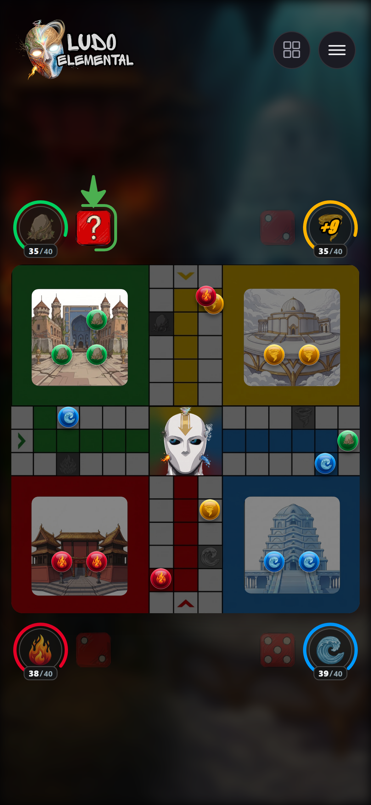
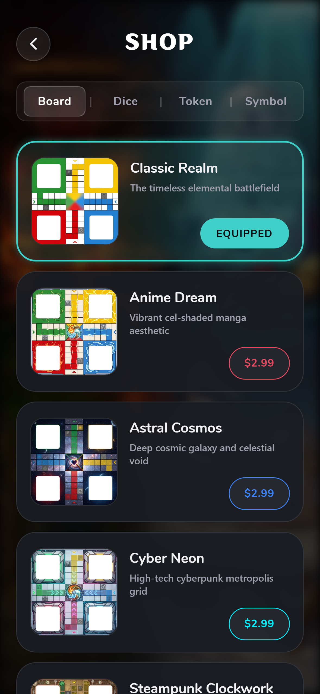
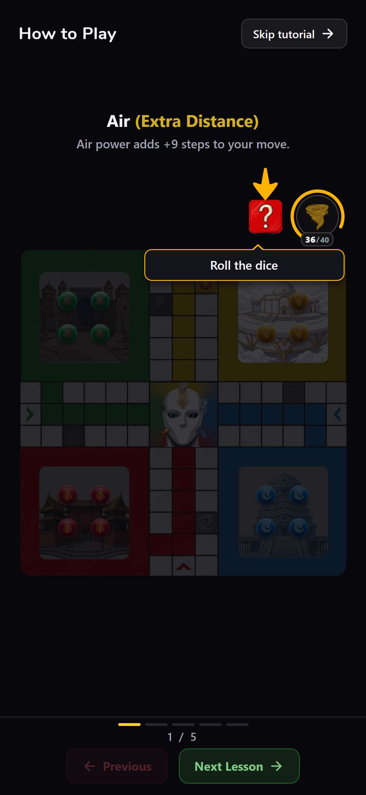

<div align="center">


# Ludo Elemental

**The board game everyone knows, with four elemental powers that make every roll a decision.**

Expo · React Native · Supabase Realtime · RevenueCat

</div>

---

## The twist

Classic Ludo is luck. Here each colour owns an element that charges as you play, so
every turn asks a question the original never did — spend it now, or save it?

| Element | Power | What it does |
| --- | --- | --- |
| Fire (Red) | **The Blaze** | Armed before you roll. Your token burns every enemy on the tiles it crosses, sending them home. Stop signs and Ice give shelter. |
| Water (Blue) | **Ice Shield** | Wraps your tokens in spiked ice. Anyone landing on them is captured instead. Immune to other powers. |
| Earth (Green) | **The Wall** | Drops a wall on any track tile. On a safe tile it shoves everyone sheltering there one step on. |
| Air (Yellow) | **The Gust** | Adds 9 steps to whatever you rolled. Cannot carry a token out of the yard. |

<div align="center">



</div>

## Modes

- **Pass N Play** — one phone, any seat a friend or a computer player.
- **Play Online** — quick matchmaking.
- **Party Code** — share a five-letter code and play a private room.
- **Tutorial** — five guided lessons that teach every power in a real game.
- Rejoin an online game after a dropped connection; undo and replay offline.

## Monetisation, powered by RevenueCat

Built for the [RevenueCat Shipaton 2026](https://revenuecat-shipaton-2026.devpost.com/).
The shop sells extra game boards as one-time, non-consumable purchases through
`react-native-purchases`. Everything for sale is cosmetic — nothing changes how
the game plays, and there are no ads.

What the integration does, all in [`purchases.js`](purchases.js) and [`shop.js`](shop.js):

- **Ownership comes only from RevenueCat's `CustomerInfo`,** never from local
  storage, so an unlock cannot be faked by editing the device.
- **Signed responses** (`ENTITLEMENT_VERIFICATION_MODE`) — a tampered response
  unlocks nothing.
- **Prices come from the store,** shown in the player's own currency.
- **Purchases follow the account** via `Purchases.logIn` with the player's
  Supabase id, so a board bought on one phone is there on the next. Restore
  brings them back after a reinstall.
- **An item is owned if its product was bought _or_ an entitlement of the same
  name is active,** so a discounted bundle can be launched from the RevenueCat
  dashboard without shipping an app update.
- **One build, two stores:** Google Play Billing, or Samsung IAP for the Galaxy
  Store, chosen by the build profile in [`eas.json`](eas.json).

## How it is put together

`engine.js` holds the rules — turn order, captures, every power — as plain
CommonJS with no React and no imports from the UI. That is what lets the whole
rulebook be driven from Node, which is how it is tested.

Online play is **host-authoritative** over a single Supabase Realtime channel:
one device runs the only engine, guests post intents and render what comes back,
so a client cannot cheat by editing its own state. Unclaimed seats are bots the
host plays. `online.js` decides seating and whether an action is allowed.

| Path | What it is |
| --- | --- |
| `engine.js` | Rules, turn order, powers. Pure, Node-testable |
| `botEngine.js` | Move selection for computer seats |
| `online.js` | Seating and the host's authority rule |
| `multiplayer.js` | Realtime transport — presence, intents, state broadcast |
| `shop.js` | Cosmetic catalogue, ownership, equipping |
| `purchases.js` | RevenueCat — prices, buy, restore |
| `components/` | Board, tokens, dice, power UI, mascot, backdrop |
| `screens/` | Splash, auth, home, setup, lobby, shop, settings |

## Tests

```bash
npm run check
```

Runs the linter, then three scanners and six suites:

- **`scripts/check-imports.js`** — a JSX tag used but never imported is invisible
  until the one branch that renders it, then it blanks the screen.
- **`scripts/check-worklets.js`** — a Reanimated worklet calling a plain helper
  works on web and is fatal on Android.
- **`scripts/check-native-props.js`** — Android demands real booleans where the
  browser accepts anything; this class of bug killed a release build on launch.
- **`engine-demo.js`, `tutorial-demo.js`, `online-demo.js`, `shop-demo.js`,
  `billing-demo.js`** — the rules, each power, the tutorial lessons, online
  seating and authority (including hundreds of out-of-turn attempts that must be
  refused), shop ownership, and the billing gates.

## Run it yourself

```bash
git clone https://github.com/stymite/Ludo-Elemental.git
cd Ludo-Elemental
npm install
cp .env.example .env     # optional: Supabase URL + anon key for online play
npm start                # or: npm run web
```

Offline modes run with no configuration at all — `supabase.js` falls back to a
stub, and the shop reports that the store is unavailable rather than failing.
Online play and purchases need the keys in `.env` / `eas.json`.

## Privacy

[Privacy policy](https://stymite.github.io/Ludo-Elemental/privacy.html) · accounts,
game data and purchases are explained there, including how to delete an account
from inside the app.

## Licence

[MIT](LICENSE) © 2026 Stymite
